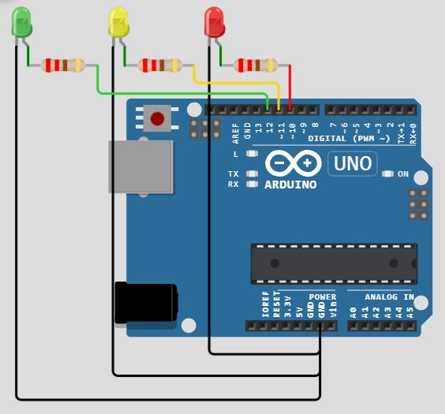

# Traffic-Light
Simple project for arduino using only three LEDs (Green, Yellow, Red) and three resistors (220Ω, all of them) to simulate a traffic light.
You can see the detail of this project at Wokwi : https://wokwi.com/projects/352773247261970433

The Circuit :

